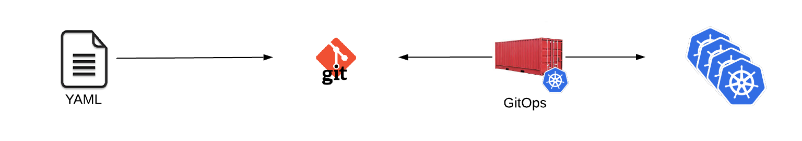

# Git Ops Introduction
RHACM also having GitOps capabilities for deploying and managing Kubernetes services. The term GitOps is applied to applications or tools that are used to the deploy YAML files that are stored within a git repository. This repository can be private repository on GitHub or GitLab, on premise, or within a public git repository.  GitOps tools can be triggered to deploy or update Kubernetes objects either manually, through a webhook, or automatically. Some GitOps tools even offer the ability to prune or remove resources automatically that are not currently defined wtihin the git repository.

* Configuration is “pulled” into an environment similiar to running a `git pull` on your system
* Some tools require a component to be installed on all clusters. These tools will pull the objects into the cluster.
* Some tools do not require any remote resources to be running. Permissions are created on the remote clusters and configuration is pushed to the cluster.
* Templating available with [Helm](https://helm.sh/) or [Kustomize](https://kustomize.io/)
* Quite simply “kubectl apply -f $path” runs over and over
* No Kubernetes object type creation limitations

## RHACM 

## Installing Red Hat Advanced Cluster Management for Kubernetes

RHACM can be installed through an Operator via the Red Hat Operators Catalog.

You can follow the public documentation available here: https://access.redhat.com/documentation/en-us/red_hat_advanced_cluster_management_for_kubernetes/1.0/html/install/

## Accessing the Web UI

You can then get the WebUI url for your just installed RHACM with this command:

~~~sh
oc  --context hubcluster -n open-cluster-management get route multicloud-console  -o jsonpath="{.status.ingress[*].host}{\"\n\"}"
~~~
 
## Adding Clusters

After accessing RHACM WebUI you can then import your clusters following the official documentation: https://access.redhat.com/documentation/en-us/red_hat_advanced_cluster_management_for_kubernetes/1.0/html/manage_cluster/index

## List the available clusters 

After completing the import you should be able to see the just imported clusters:

~~~sh
oc get clusters -A --show-labels
as4test     as4test     api.as4test.lp.int:6443           Ready     1d
heisenbug   heisenbug   api.heisenbug.lplab.online:6443   Ready     1d
jelly       jelly       api.jelly.lplab.online:6443       Ready     1d
~~~

above command don't work, please use below command

~~~sh
oc get managedcluster
NAME            HUB ACCEPTED   MANAGED CLUSTER URLS   JOINED   AVAILABLE   AGE
cckcluster01    true                                  True     True        29h
cckcluster02    true                                  True     True        86m
cckcluster03    true                                           Unknown     19m
local-cluster   true                                  True     True        38h
~~~

## Labeling the imported (or created) clusters

For achieving the right placement of the next labs, you'll need to set a label for identifying your just imported (or created) clusters.

***Please Note: pay attention to assign the right label to the respective cluster.***

~~~sh
oc label managedcluster -n YOUR_ACM_CLUSTER1_NAME YOUR_ACM_CLUSTER1_NAME clusterid=cluster1
oc label managedcluster -n YOUR_ACM_CLUSTER2_NAME YOUR_ACM_CLUSTER2_NAME clusterid=cluster2
oc label managedcluster -n YOUR_ACM_CLUSTER3_NAME YOUR_ACM_CLUSTER3_NAME clusterid=cluster3
~~~

You can check the correct labeling by executing this command:

~~~sh
oc get clusters -A --show-labels
~~~

above command don't work, please use below command

~~~sh
oc get managedcluster -A --show-labels
NAME            HUB ACCEPTED   MANAGED CLUSTER URLS   JOINED   AVAILABLE   AGE    LABELS
cckcluster01    true                                  True     True        29h    cloud=Amazon,clusterID=acfb0e20-e74f-4520-bae5-fb7bb3f3828d,clusterid=cluster1,environment=prod,name=cckcluster01,vendor=OpenShift
cckcluster02    true                                  True     True        100m   cloud=Amazon,clusterID=b1c57466-0b62-4bc5-9a59-163db5fbb02c,clusterid=cluster2,name=cckcluster02,region=sa-east-1,vendor=OpenShift
local-cluster   true                                  True     True        38h    cloud=Amazon,clusterID=fdc693cf-9f35-4e82-bd38-cf425e9711f6,environment=dev,installer.name=multiclusterhub,installer.namespace=open-cluster-management,local-cluster=true,name=local-cluster,region=EU,vendor=OpenShift
~~~

[Home](./README.md)
